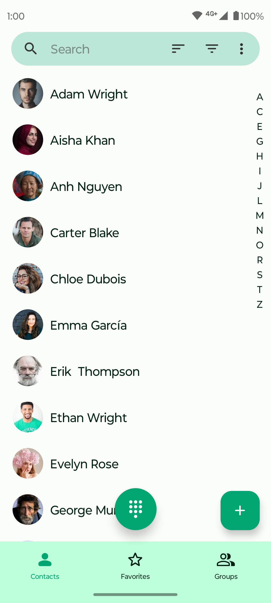
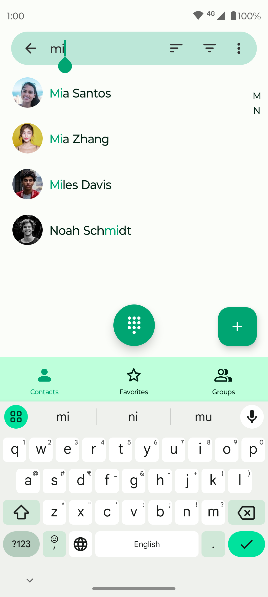
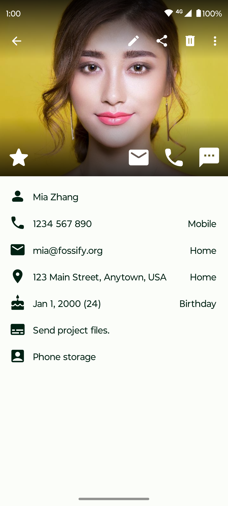

# Fossify Contacts

  

Introducing Fossify Contacts - the next evolution in contact management. Poised to redefine how you manage your contacts, our app combines simplicity with advanced features, tailored for both personal and professional use.  

🔍 **SMART SEARCH & FIELD CUSTOMIZATION:**  
Locate contacts quickly with our intelligent search feature. Customize visible fields, enjoy a user-friendly interface, and find contacts effortlessly, saving time and enhancing productivity.

✉️ **GROUP MANAGEMENT & COMMUNICATION:**  
Effortlessly manage contact groups for streamlined communication. Our app facilitates easy grouping for batch emails or SMS, with features to create favorite lists and rename groups, enhancing your organizational capabilities.

🔄 **RELIABLE BACKUP & EXPORT OPTIONS:**  
Ensure your contacts are always safe with our reliable backup system. Seamlessly export or import contacts in vCard format, making data migration and backup a breeze.

🌐 **OPEN-SOURCE TRANSPARENCY:**  
Built on an open-source platform, Fossify Contacts champions transparency and user trust. Access our code on GitHub and become part of a community that values privacy, openness, and collaborative improvement.

🖼️ **PERSONALIZED USER EXPERIENCE:**  
Customize your contact management with ease. Our app offers flexible settings and design options, allowing you to tailor the interface to your liking. Sort contacts, choose themes, and personalize your experience for maximum convenience.

🔋 **EFFICIENT & LIGHTWEIGHT:**  
Optimized for performance, Fossify Contacts is designed to be light on your device's resources. It not only organizes your contacts efficiently but also contributes to longer battery life, ensuring smooth operation.

🚀 **ADVANCED SYNCHRONIZATION:**  
Whether you choose to store your contacts locally or prefer syncing them across devices using different means, our app ensures a smooth, efficient, and secure management experience.

🔐 **PRIVACY-FIRST APPROACH:**  
Your contact information remains confidential with Fossify Contacts. We prioritize your privacy, ensuring your data is never shared with third-party apps.

🌙 **MODERN DESIGN & USER-FRIENDLY INTERFACE:**  
Enjoy a clean, modern design with a user-friendly interface. The app features material design themes and a supports dynamic theming, providing a visually appealing and comfortable user experience.

Download the app now and elevate your contact management to new heights. Your journey to efficient, secure, and intuitive contact organization begins here.

➡️ Explore more Fossify apps: https://www.fossify.org 
➡️ Open-Source Code: https://www.github.com/FossifyOrg 
➡️ Join the community on Reddit: https://www.reddit.com/r/Fossify 
➡️ Connect on Telegram: https://t.me/Fossify

